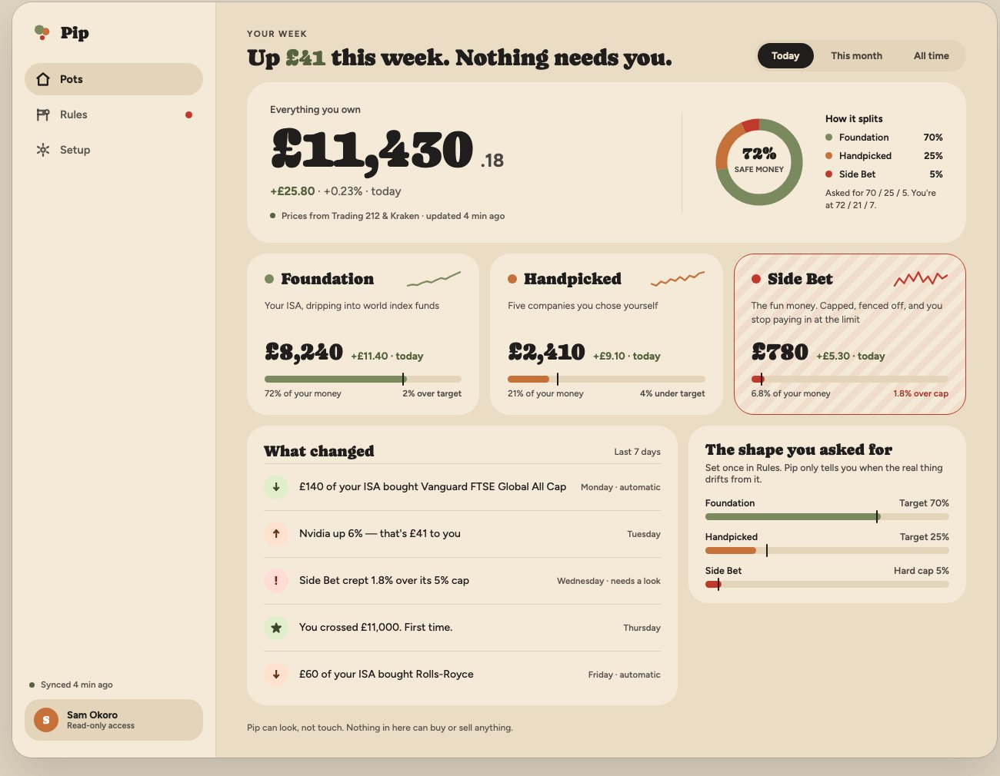
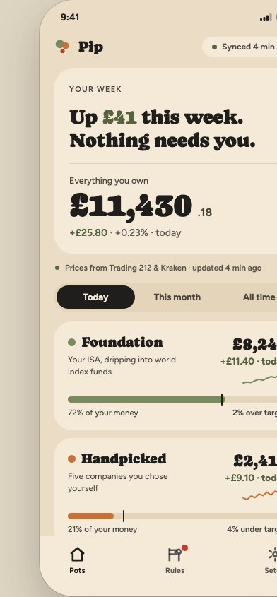
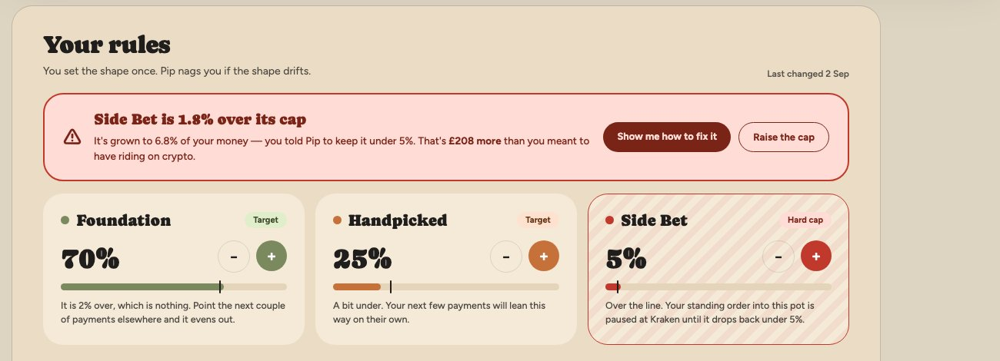
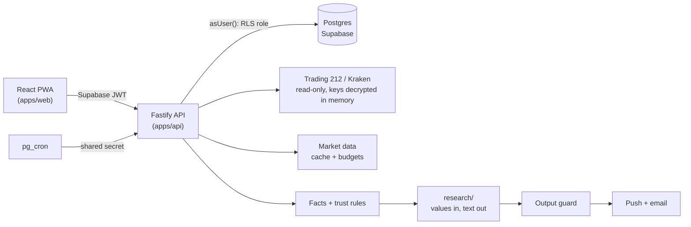

# Pip

**A calm, read-only investing dashboard that turns a Trading 212 account and a Kraken account into three "pots" and one number, and only speaks up when something matters.**

[](https://github.com/waq-b/pip-app/actions/workflows/ci.yml)

> **Status: parked, not abandoned.** I paused Pip to stop paying for hosting. It works end to end against a Trading 212 practice account, but it is not deployed, so there is no live URL.



_Design mockups, not screenshots of the running app: the figures are sample data. The built UI follows these layouts (see [docs/DESIGN.md](docs/DESIGN.md) for where it differs)._

## What it guarantees

- **Read-only. It never places orders.** The Trading 212 client only issues `GET` requests to an allowlist of paths. The Kraken client only calls key info, balances and ledger, and a test scans its source for money-moving methods.
- **A deterministic rules engine decides everything that touches money.** Targets, limits, drift and recommended amounts are computed by pure functions. The LLM only writes words about values it is handed.
- **LLM output is schema-constrained and guarded.** Requests to Groq use strict JSON-schema output, and every sentence then passes an output guard that rejects forecasts, price targets and amounts, falling back to Pip's own template.
- **Provider keys are encrypted per user with AES-256-GCM.** Each value is bound to its user, provider, account and field, so a ciphertext copied to another row will not open. The master key lives on the app host, not beside the database.
- **Kraken keys that can trade or withdraw are refused.** Pip reads the key's own permission report and rejects anything beyond reading balances and the ledger, including permissions it doesn't recognise.
- **CI never touches a broker, market source, LLM or hosted database.** Everything runs in stub mode, with recorded (anonymised) provider responses replayed in tests and PGlite for database tests.

## Why I built it

Most retail investing apps encourage you to watch prices and trade more. Pip is the opposite: it reads your accounts, groups the money into three pots with rules you set, and tells you in plain English when a pot has drifted or a limit is close. It was also a way to practise building a multi-user product where the interesting problems are trust boundaries and data freshness, not CRUD.

## Features

- **Three pots, one number.** Foundation (long-term index funds in an ISA), Handpicked (individual holdings you chose) and Side Bet (a small, hard-limited crypto pot). Money is never counted or shown across pots.
- **Read-only connections** to Trading 212 (practice account) and Kraken.
- **Rules.** Target shares for two pots and a limit in pounds for Side Bet, judged by one engine that every screen reads.
- **Prices and history.** A shared price cache over several market-data sources with fallbacks and daily call budgets. History is rebuilt from order history and the Kraken ledger.
- **Honest staleness.** Every figure carries its age and walks a fresh, amber, red ladder rather than showing old numbers as current.
- **"Your week".** News and facts about what you hold feed a weekly digest, capped urgent notes, push and email, each with its sources and reasoning.
- **Installable PWA** with web push, phone, tablet and desktop layouts, light and dark.

<p>


</p>

_Design mockups again: the phone Pots screen and the Rules screen with Side Bet over its cap._

## Architecture



- `apps/web`: React PWA (screens, charts, service worker).
- `apps/api`: Fastify API: auth, providers, sync, market data, rules, facts, research, notifications, jobs.
- `packages/shared`: types shared by web and API.
- `packages/emails`: pure email templates (data in, subject, HTML and text out).

More detail in [docs/ARCHITECTURE.md](docs/ARCHITECTURE.md), [docs/FEATURES.md](docs/FEATURES.md) and [docs/DESIGN.md](docs/DESIGN.md).

## Stack

TypeScript monorepo (pnpm workspaces). React, Vite and Tailwind; Node and Fastify; Postgres with Drizzle ORM and Supabase Auth; Groq for LLM wording; Resend for email; Web Push (VAPID). Tests use Vitest, Testing Library and PGlite. It was deployed as one Render service with Supabase Postgres and `pg_cron` for scheduling.

## Design decisions worth a look

1. **Code decides the money; the LLM writes words.** The `research/` module can only receive values and return text. `research/wall.test.ts` fails if any file there imports from outside its folder (other than shared types) or touches the network, environment or process.
2. **Per-user key encryption with context binding.** The AES-GCM additional data includes user, provider, account kind and field. Master keys are versioned and there is a re-seal tool for rotation.
3. **Fastify is the wall; Row Level Security is the second wall.** User-facing reads run in a transaction that sets the verified user id and drops to a non-bypass role (`db/user-scope.ts`), so a route bug still cannot read another user's rows. `db/rls.test.ts` exercises this, and a test walks the route table to check that every non-exempt route answers 401 without a token.
4. **Stub mode is first class.** Providers, market data, the LLM and notification senders all have stubs that need no network.
5. **Built to sleep.** Free-tier hosting means Pip may be asleep, so nothing pings it. Every job records a run, and a check inside the database flags stale or missing work.

## Run it locally

Requires Node 20+ and pnpm.

```bash
pnpm install
pnpm test        # no keys, network or database needed
```

To run the app itself you need a (free) Supabase project, because sign-in is real even in stub mode. Provider data, market data, the LLM and notifications are all stubbed by default.

```bash
cp .env.example apps/api/.env   # fill in DATABASE_URL, SUPABASE_URL, VITE_SUPABASE_*
pnpm --filter api db:migrate
pnpm --filter api allowlist add you@example.com
pnpm --filter api dev           # API on :3001
pnpm --filter web dev           # web on :5173
```

`pnpm --filter api sign-in-link` creates a one-time local sign-in link without sending an email. I have not re-run this local setup since parking the project, so treat the steps as a guide; the test suite is the part I verify on every change.

## Tests and CI

GitHub Actions runs `pnpm lint`, `pnpm format:check`, `pnpm test` and `pnpm build` on every push and pull request, with `PROVIDER_MODE=stub`. There are 1,348 tests: the API (922 tests in 69 files, covering the rules engine, sync, valuation, crypto, RLS, notifications and the research guard), the web app (342, in jsdom), the email templates (77) and the shared package (7).

## Status and roadmap

Phases 0 to 6 are built: stub UI, Trading 212 practice accounts, Kraken read-only, the rules engine, research and the weekly digest, and notifications. Planned but not built: deep links to the broker for each holding, connecting real-money Trading 212 accounts, and a beta. Pip is not financial advice and never moves money. See [CHANGELOG.md](CHANGELOG.md).

## License

MIT, see [LICENSE](LICENSE).
